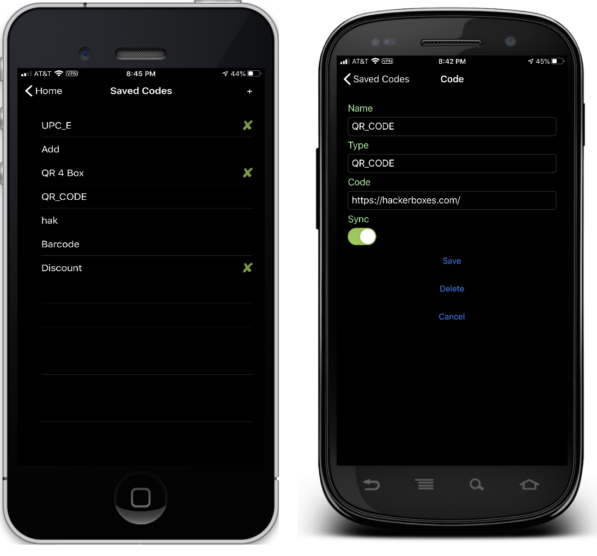
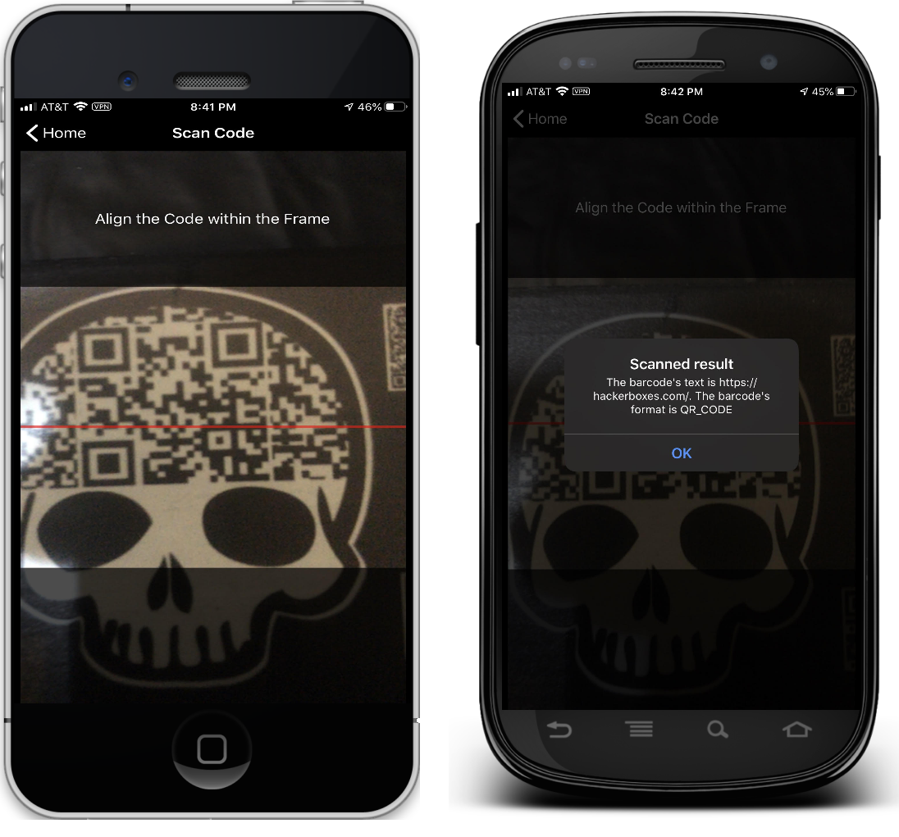

# Simple Scanner Application

This sample demonstrates a Scanner application where the data is stored and accessed in a local SQLite database.

The app functionality is:

- View a list of saved codes.
- Add a new code to the list.
- Set a code's status to be 'synced'.
- Scan any barcode/QR code and save it to the phone.

In all cases the tasks are stored in a local SQLite database.

For more information about the sample see [Working with a Local Database](https://docs.microsoft.com/xamarin/xamarin-forms/data-cloud/data/databases).

